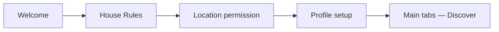
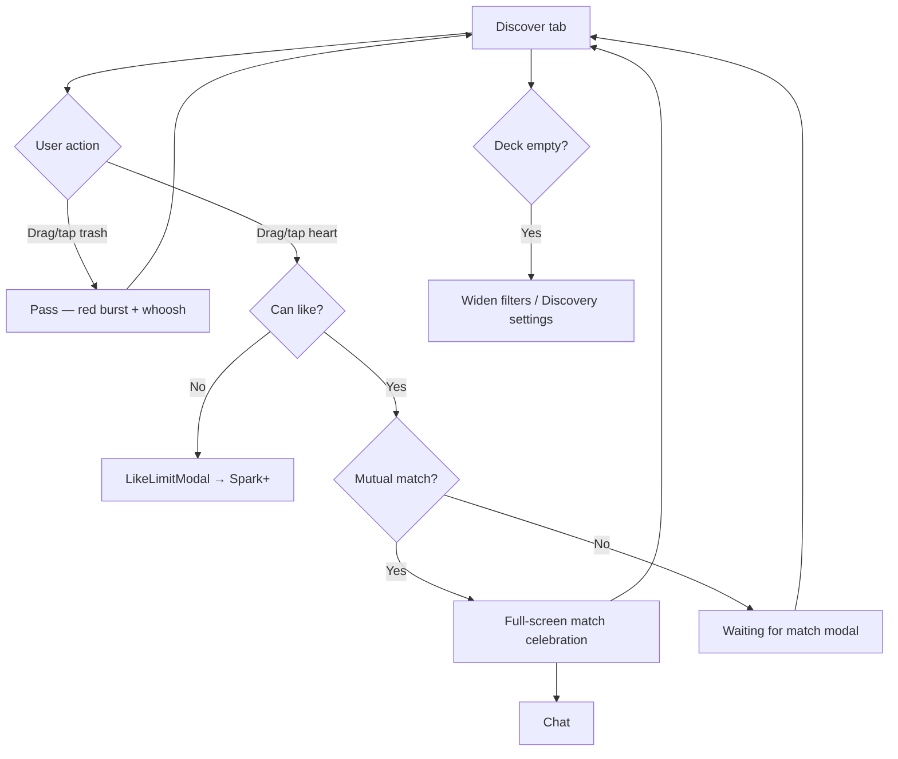
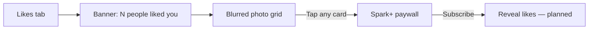
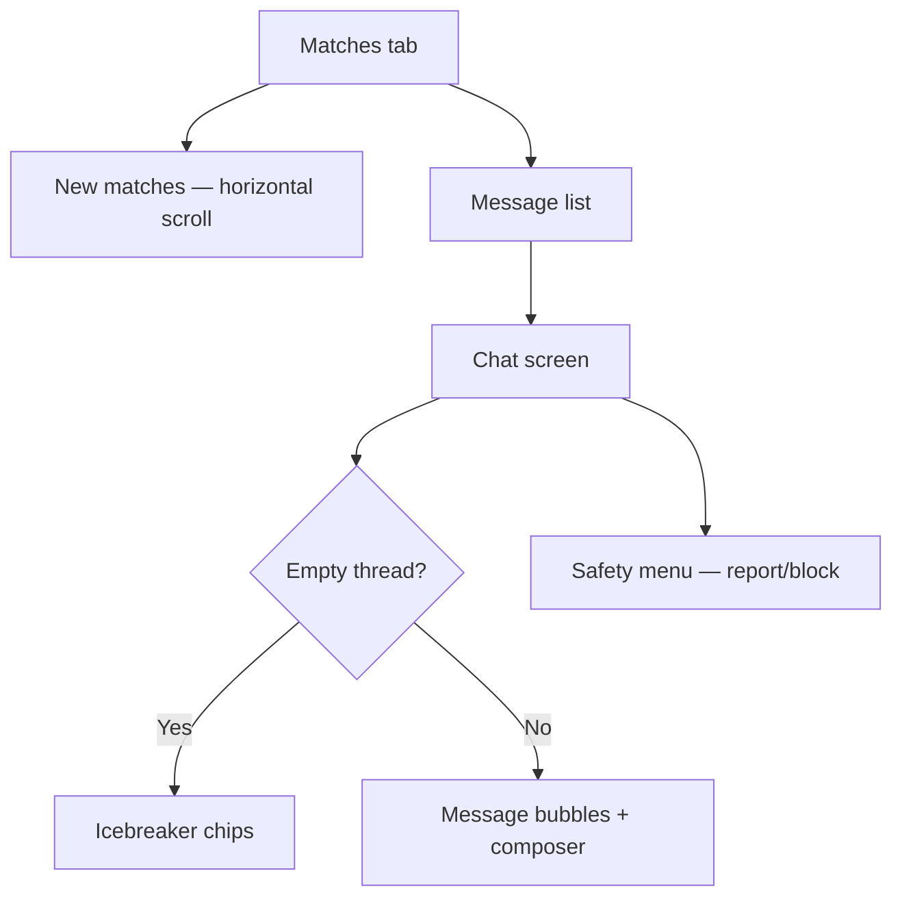

# Spark — Full App Document

**Authoritative product & technical reference**  
**Audience:** Mon (Designer), product, engineering  
**Last updated:** September 2026  
**Repo:** [MonMonMars/New-APP01](https://github.com/MonMonMars/New-APP01)

---

## Table of contents

1. [Executive summary](#1-executive-summary)
2. [Competitive landscape](#2-competitive-landscape)
3. [Product principles](#3-product-principles)
4. [User journeys](#4-user-journeys)
5. [Screen inventory](#5-screen-inventory)
6. [State & data model](#6-state--data-model)
7. [Interaction design](#7-interaction-design)
8. [Monetization](#8-monetization)
9. [Safety & trust](#9-safety--trust)
10. [Technical stack & project structure](#10-technical-stack--project-structure)
11. [Roadmap](#11-roadmap)
12. [Appendix — demo data](#12-appendix--demo-data)

---

## 1. Executive summary

**Spark** is an iOS-first dating app prototype built with **Expo + React Native + TypeScript**. It targets singles who want a familiar dating-app workflow without the mindless swipe-left/right mechanic that defines Tinder-era products.

| Dimension | Spark |
|-----------|-------|
| **Platform** | iOS-first (Expo Go, simulator); web preview for stakeholder demos |
| **Target users** | Intentional daters, 21–35, urban; launch wedge: one metro with balanced liquidity |
| **Core loop** | Onboard → discover profiles → drag to heart/trash → match → message → return |
| **Differentiator** | **Drag-to-target** discovery (trash = pass, heart = like) — legally distinct from patented swipe gestures |
| **Monetization** | Freemium **Spark+** subscription (see who likes you, unlimited likes, boost, rewind) |
| **North-star metric** | % of new users who reach **first mutual match + first message within 24 hours** |

Spark implements industry-standard patterns from **Tinder**, **Bumble**, and **Hinge** (blurred likes inbox, match celebration, icebreaker chat, daily like limits, safety center) while owning a playful, intentional discovery interaction.

**Tagline options:** “Match with intention.” · “Drag your heart into it.” · “Dating, without the mindless swipe.”

---

## 2. Competitive landscape

Research synthesized from Tinder, Bumble, Hinge, Badoo, and Coffee Meets Bagel (2024–2026 patterns). Spark **adopts proven conversion and retention mechanics** and **avoids swipe IP**.

### 2.1 Pattern matrix

| Pattern | Tinder | Bumble | Hinge | Spark adopts? | Spark implementation |
|---------|--------|--------|-------|---------------|----------------------|
| Post-like (no mutual) | Silent; keep swiping | Silent; keep swiping | Comment sent; keep browsing | ✅ | **Waiting for match** modal + “Find more people” |
| Match celebration | Full-screen “It’s a Match!” | Full-screen + Opening Move | Subtle toast | ✅ | **Full-screen gradient celebration** → Send Message / Keep Swiping |
| Likes inbox | Gold blur grid + badge | Beeline blur + Premium CTA | Roses / likes tab | ✅ | **Blurred grid + count badge + Spark+ CTA** |
| Daily like limit | ~100/12h | Daily cap; Premium unlimited | 8 free/day | ✅ | **10/day free** + banner + LikeLimitModal |
| Empty deck | “Out of people” + widen search | Same + Snooze | “You’re all caught up” | ✅ | **“No more people nearby”** + Widen filters |
| Matches list | New matches row + inbox | New matches + 24h expiry ring | “Your turn” badge | ✅ | **New matches row + Your turn + Expires in Xh** |
| Chat openers | GIFs, suggested messages | Opening Moves, icebreakers | Prompt replies | ✅ | **Icebreaker chips** on empty thread |
| Profile detail | Photo carousel, bio | Badges, modes | Prompt cards | ✅ | **Hinge-style prompt cards** in profile sheet |
| Safety | Report/block in chat & profile | Safety Center hub | Report/block | ✅ | **Safety Center + report/block** in chat & profile |
| Tab badges | Likes count, unread | Beeline count, chat badge | Likes + matches | ✅ | **Dynamic Likes + Matches badges** |
| Premium upsell | Blur tap, like limit, Boost | Beeline tap, Spotlight | Rose limit, Hinge+ | ✅ | Likes tap, like limit modal, Spark+ screen |
| **Discovery gesture** | **Swipe left/right (patented)** | Swipe | Tap like on prompts | ❌ Avoid | **Drag card → trash / heart** |
| Top Picks / Standouts | Top Picks | For You (4/day) | Standouts (Roses) | Bagels at noon | ✅ **Standouts row** on Discover |
| Recently active | Active status | Online now | Active today | Online badge | ✅ **Recently active strip** |
| Super Like effects | Super Like animation | SuperSwipe | Rose | Crush | ✅ **SuperLikeCelebration** + result modal |
| Super Likes sent | Gold Super Likes tab | — | Roses sent | — | ✅ **Super Likes sent** in Likes tab |
| Super Matches | — | — | — | — | ✅ **Super Matches** row in Matches |
| Explore stacks | Explore / Passport | Modes | — | Encounters filters | ✅ **Explore screen** (Serious / New / Nearby) |

### 2.2 Positioning summary

| App | Positioning | Monetization anchor |
|-----|-------------|---------------------|
| **Tinder** | Scale, casual, swipe culture | See who liked you, unlimited likes, Boost |
| **Bumble** | Women message first, safety | Beeline, Spotlight, Premium filters |
| **Hinge** | “Designed to be deleted,” prompts | Roses, unlimited likes, HingeX placement |
| **Spark** | Intentional drag, playful UX | Spark+ (see likes, unlimited, boost, rewind) |

### 2.3 Legal / IP note

Match Group holds **patents and trademarks** on Tinder’s swipe-left/right matching UX. Spark deliberately uses **drag-to-target** (card toward trash or heart zones, or tap zone buttons) to preserve the dating mental model without replicating patented gestures. Branding, copy, and visual identity must remain distinct before App Store launch. See README legal note in repo.

---

## 3. Product principles

Design decisions grounded in competitor research and category benchmarks (Adjust 2026, Match Group filings):

1. **Liquidity before scale** — Launch one city; empty decks kill retention. Geo-density beats nationwide launch.
2. **Free tier must produce real matches** — Paid sells speed and control, not access to matching itself.
3. **One quality action per session** — Every screen pushes toward like, match, or message — not endless browsing.
4. **Intentional discovery** — Drag-to-target slows the pass/like decision vs. reflexive swiping; haptics, sound, and particles reinforce each choice.
5. **Borrow conversion, own interaction** — Blur paywall, match modal, icebreakers, and daily limits are proven; discovery gesture is Spark-owned.
6. **Safety is non-negotiable** — House rules at onboarding, Safety Center, report/block in-context; verification and moderation on roadmap.
7. **Event-based paywalls** — Highest conversion at moment of intent: blurred like tap, daily cap, post-match momentum.

---

## 4. User journeys

### 4.1 Onboarding



| Step | Purpose | Key UI |
|------|---------|--------|
| **Welcome** | Auth entry | “Continue with Apple” / phone link (prototype skips real auth) |
| **House Rules** | Trust & compliance | Be yourself, meet in public, be kind, report bad behavior |
| **Location** | Discovery prerequisite | Map placeholder; “People within 25 miles” |
| **Profile setup** | Minimum viable profile | Name, bio; completes `hasOnboarded` |

**Competitor analog:** Tinder house rules early + Hinge prompt-heavy profile (simplified for MVP).

### 4.2 Discovery



**Flow detail:**

1. One profile card visible from `discoverQueue`.
2. Tap photo edges to browse carousel (Tinder-style dots).
3. **Pass:** drag to bottom-left trash or tap trash → pass recorded, next card.
4. **Like:** drag to bottom-right heart or tap heart → daily counter increments (unless Spark+).
5. **One-sided like** → Waiting for match modal (“Find more people”).
6. **Mutual like** (demo: profile **Mia**, id `3`) → full-screen celebration → Send Message or Keep Swiping.
7. **Like cap** (10/day free) → LikeLimitModal → Spark+.
8. **Empty deck** → widen distance/age or open Discovery preferences sheet.

### 4.3 Likes inbox



- Tab badge shows incoming count (4 in demo: profiles 7–10).
- Spark+ subscribers: badge clears; reveal flow planned for backend phase.
- Pattern source: Tinder Gold / Bumble Beeline.

### 4.4 Matches & chat



- **New matches:** horizontal row for matches with no messages yet.
- **Message list:** preview, unread dot, **Your turn** badge (Hinge), **Expires in Xh** (Bumble urgency).
- **Chat:** icebreakers when empty; expiry in header; safety action sheet.
- **Tab badge:** new matches + unread + your-turn count.

### 4.5 Profile & settings

- Hero card: photo, name, age, bio, Edit profile (placeholder).
- Stats: likes sent, matches, profile score (mock 78%).
- Interest tags.
- Settings rows: Discovery preferences, Safety & privacy, Notifications (placeholder), Spark+ subscription.
- Referral CTA (prototype).

### 4.6 Safety (report / block)

Available from:

- Profile detail sheet (Discover)
- Chat safety menu
- Safety Center (stack push from Profile or Matches header)

**Report** and **block** remove the profile from deck, matches, and conversations (prototype: report = block + confirmation).

---

## 5. Screen inventory

### 5.1 Navigation architecture

```
Root Stack
├── OnboardingFlow (until hasOnboarded)
│   ├── Welcome
│   ├── House Rules
│   ├── Location permission
│   └── Profile setup
└── Main (Bottom Tabs × 4)
    ├── Discover (+ modals/sheets below)
    ├── Likes
    ├── Matches
    └── Profile
    ├── Chat (stack push)
    ├── SparkPlus (modal)
    └── Safety (stack push)
```

### 5.2 Screen reference

| Screen / surface | Type | Purpose | Key UI elements |
|------------------|------|---------|-----------------|
| **Welcome** | Onboarding step | Auth entry | Spark badge, Apple / phone CTAs |
| **House Rules** | Onboarding step | Community standards | 4 rule bullets, “I agree” |
| **Location** | Onboarding step | Permission framing | Map placeholder, enable CTA |
| **Profile setup** | Onboarding step | MVP profile | Name, bio inputs |
| **Discover** | Tab | Core loop | SwipeDeck, drop targets, like-limit banner, settings icon |
| **Profile detail sheet** | Modal | Deep profile | Photo carousel, prompts, interests, report/block |
| **Discovery preferences sheet** | Modal | Filters | Max distance, age range |
| **Waiting for match modal** | Modal | Post one-sided like | Avatar, “Find more people” |
| **Match celebration** | Full-screen modal | Mutual match | Gradient, dual avatars, Send Message / Keep Swiping |
| **Like limit modal** | Modal | Paywall trigger | Remaining likes, Spark+ CTA |
| **Empty deck state** | Inline | Deck exhausted | Widen filters, open preferences |
| **Likes** | Tab | Monetization anchor | Count banner, blurred grid, Spark+ button |
| **Matches** | Tab | Retention hub | New matches row, conversation list, expiry/your-turn |
| **Chat** | Stack | Activation | Header + expiry, icebreakers, composer, safety menu |
| **Profile** | Tab | Identity & settings | Stats, interests, settings rows, referral |
| **Spark+** | Modal | Subscription | Feature list, plan picker, subscribe CTA |
| **Safety Center** | Stack | Trust | Tips, resources, support links |

### 5.3 Tab bar

| Tab | Icon | Badge source |
|-----|------|--------------|
| Discover | flame | — |
| Likes | heart | `incomingLikes.length` (hidden if Spark+) |
| Matches | chatbubble | new matches + unread + your turn |
| Profile | person | — |

---

## 6. State & data model

Central state lives in `AppContext.tsx` (in-memory prototype; backend planned).

### 6.1 Context fields

| Field | Type | Description |
|-------|------|-------------|
| `hasOnboarded` | boolean | Gates onboarding vs main app |
| `user` | `UserProfile` | Current user name, age, bio, photos, interests, intent |
| `preferences` | `DiscoveryPreferences` | maxDistanceMiles, minAge, maxAge |
| `discoverQueue` | `Profile[]` | Filtered mock profiles minus excluded |
| `passedIds` | `Set<string>` | Passed profiles |
| `likedIds` | `Set<string>` | Liked profiles |
| `pendingLikeIds` | `Set<string>` | One-sided likes awaiting mutual |
| `blockedIds` | `Set<string>` | Blocked profiles |
| `matches` | `Match[]` | Mutual matches with expiry |
| `conversations` | `Conversation[]` | Threads with messages |
| `incomingLikes` | `Profile[]` | Blurred likes inbox (ids 7–10) |
| `dailyLikesUsed` | number | Resets conceptually daily (not persisted) |
| `remainingLikes` | number | `FREE_DAILY_LIKE_LIMIT - used` or ∞ if Spark+ |
| `canLike` | boolean | Gate before like action |
| `likesTabBadge` | number | Incoming count unless Spark+ |
| `matchesTabBadge` | number | Composite engagement signal |
| `isSparkPlus` | boolean | Subscription flag (prototype toggle) |

### 6.2 Core types

**Profile:** `id`, `name`, `age`, `bio`, `distanceMiles`, `photos[]`, `interests[]`, optional `job`, `school`, `verified`, `prompts[]`.

**Match:** `id`, `profile`, `matchedAt`, optional `expiresAt` (24h default on new matches).

**Conversation:** `id`, `match`, `messages[]`, `lastMessage`, `yourTurn`, `unread`.

**DiscoveryPreferences:** default 25 mi, ages 21–35.

### 6.3 Key actions

| Action | Behavior |
|--------|----------|
| `passProfile` | Add to `passedIds`; remove from queue |
| `likeProfile` | Increment daily count; if in `MUTUAL_MATCH_IDS` → create match + conversation; else → `pendingLikeIds` |
| `sendMessage` | Append message; clear your turn / unread |
| `blockProfile` / `reportProfile` | Add to blocked; prune matches & conversations |
| `activateSparkPlus` | Unlimited likes; clear likes badge |
| `updatePreferences` | Refilter discover queue |

---

## 7. Interaction design

### 7.1 Drag-to-target discovery

Unlike swipe-left/right:

1. User sees **one card** at a time (`SwipeDeck` + `ProfileCard`).
2. **Pan gesture** moves card; proximity to zones highlights trash (red) or heart (green).
3. **Release in zone** → pass (left) or like (right); release outside → spring back.
4. **Tap targets** — trash/heart buttons duplicate gesture for accessibility.
5. **Zone hit padding** — 36px tolerance for forgiving drops.

### 7.2 Feedback layers

| Layer | Pass (trash) | Like (heart) |
|-------|--------------|--------------|
| **Visual** | Red flash + particle burst | Green flash + hearts burst |
| **Haptic** | `expo-haptics` impact | Success notification |
| **Sound** | Whoosh (`expo-av`) | Chime |
| **Animation** | Card flies to zone; `SwipeBurstEffect` | Same |

Web preview requires user click first (browser autoplay policy).

### 7.3 Limits & empty states

| State | UX |
|-------|-----|
| **Daily like cap** | Banner on Discover; modal blocks like; Spark+ CTA |
| **Empty deck** | Copy + “Widen search” (+10 mi, +5 max age) + preferences sheet |
| **Empty chat** | Three icebreaker chips pre-fill composer |
| **Waiting modal** | Reinforces Tinder/Bumble silent-like pattern without blocking discovery |

---

## 8. Monetization

### 8.1 Spark+ feature bundle

| Feature | Description |
|---------|-------------|
| **See who likes you** | Anchor — unblur Likes grid, instant match |
| **Unlimited likes** | Removes 10/day cap |
| **1 free Boost / week** | 30 min top visibility (UI planned) |
| **Unlimited rewinds** | Undo pass |
| **Advanced filters** | Intent, interests (roadmap) |
| **Spark Notes** | Pre-match message, 1/day (roadmap) |

### 8.2 Pricing (launch suggestion)

| Plan | Price | Notes |
|------|-------|-------|
| Weekly | $12.99 | Impulse tier |
| Monthly | $14.99/mo | Default |
| Annual | $99.99/yr (~$8.33/mo) | Best value — default selection in UI |

Industry: subscriptions ~69% of category revenue (2025 benchmarks).

### 8.3 Free tier

- **10 likes per day** (`FREE_DAILY_LIKE_LIMIT`)
- Blurred incoming likes (count visible, identities hidden)
- Full discovery, matching, and chat

### 8.4 Paywall touchpoints

| Trigger | Screen | Conversion intent |
|---------|--------|-------------------|
| Tap blurred like | Likes → Spark+ | Highest — user knows someone liked them |
| Daily cap reached | LikeLimitModal | Scarcity |
| Likes tab diamond icon | Spark+ | Exploratory |
| Profile → Spark+ row | Spark+ | Settings intent |
| Post-3rd match (planned) | Modal | Momentum |

---

## 9. Safety & trust

### 9.1 Implemented (prototype)

- **House rules** at onboarding (4 community guidelines)
- **Safety Center** — tips (meet in public, trust instincts, protect info, video chat) + resource links
- **Report / block** in profile detail sheet and chat safety menu
- Block removes profile from all surfaces

### 9.2 Roadmap

| Item | Priority |
|------|----------|
| Age gate 18+ | v0.2 |
| Photo verification badge | v1.0 |
| Moderation queue (<24h review) | v1.0 |
| Unmatch (distinct from block) | v0.2 |
| In-app support ticketing | v1.0 |

### 9.3 Compliance notes

- Privacy policy and terms required before production launch
- Location: frame as approximate distance only; never show exact coordinates
- GDPR/CCPA data handling when backend ships
- App Store dating category guidelines: safety reporting, age restriction, no explicit content

---

## 10. Technical stack & project structure

### 10.1 Stack

| Layer | Technology |
|-------|------------|
| Framework | Expo ~57, React Native 0.86, React 19 |
| Language | TypeScript |
| Navigation | React Navigation 7 (native stack + bottom tabs) |
| Gestures / animation | react-native-gesture-handler, react-native-reanimated |
| Media | expo-av (sound), expo-haptics, expo-linear-gradient |
| State | React Context (`AppContext`) + AsyncStorage persistence |

### 10.2 Project layout

```
src/
  context/         AppContext — global state
  navigation/      AppNavigator — stack + tabs
  screens/         Discover, Likes, Matches, Profile, Chat, Safety, SparkPlus, Onboarding
  components/      SwipeDeck, DropTargets, modals, sheets, effects
  data/            mockProfiles, conversations, MUTUAL_MATCH_IDS
  types/           profile, match, preferences, subscription, navigation
  hooks/           useSwipeSounds
  utils/           matchTiming (expiry labels)
  theme/           colors, spacing, radii
docs/
  SPARK_APP_DOCUMENT.md   ← this document
  APP_FLOW.md             UI map + competitor matrix
  PRODUCT_STRATEGY.md     GTM, monetization, metrics
  PUBLIC_PREVIEW.md       Browser demo links
```

### 10.3 Run commands

```bash
npm install
npm start          # Expo Go — scan QR on iPhone
npm run web        # Browser at localhost:8081
npm run ios        # Xcode simulator (Mac)
```

Public preview: see `docs/PUBLIC_PREVIEW.md`.

### 10.4 Architecture notes

- **No backend yet** — all data persisted locally via AsyncStorage; survives app restart
- **Navigation key** on `hasOnboarded` remounts stack when onboarding completes
- **Discover queue** computed via `useMemo` from profiles − passed − liked − blocked, filtered by preferences
- **Match creation** synchronous in `likeProfile`; checks `MUTUAL_MATCH_IDS` set

---

## 11. Roadmap

### Built (MVP+)

- [x] Drag-to-target discovery + haptics, sound, particles
- [x] Onboarding flow (welcome → rules → location → **intent** → profile)
- [x] Four-tab navigation with dynamic badges
- [x] Likes inbox with blur paywall
- [x] Matches list with new matches, expiry, your turn
- [x] Chat with icebreakers, report/block
- [x] Spark+ paywall screen + prototype activation
- [x] Daily like limit (10) + upgrade modal
- [x] Safety Center
- [x] Hinge-style profile prompts in detail sheet
- [x] Discovery preferences (distance, age, **gender show-me**)
- [x] **Profile edit** (name, bio, age) + photo add placeholder
- [x] **Onboarding persistence** (AsyncStorage — survives app restart)
- [x] **Relationship intent** step in onboarding
- [x] **Spark+ unlocks** blurred likes (names + photos revealed)
- [x] **Match toast** banner on mutual match
- [x] **Safety Center** reachable from Profile, Matches shield, and chat menu
- [x] Waiting-for-match + full-screen match celebration
- [x] Web preview tunnel for stakeholder demos
- [x] Loading/hydration gate on app boot from AsyncStorage
- [x] Empty states (Discover, Likes, Matches, Chat)

### Next (v0.2)

- [x] Apple Sign-In stub (expo-apple-authentication on iOS; demo stub on web)
- [x] Push notifications stub (permission prompt + local notification on match)
- [x] Photo upload + camera roll (expo-image-picker — onboarding + profile edit)
- [x] Spark Note (pre-match message with like)
- [x] Backend (Supabase — client + schema + graceful AsyncStorage fallback)
- [x] Full AsyncStorage persistence (matches, chats, likes, passes, spark+, boost, photos)
- [x] Unmatch flow (chat + safety menu with confirm dialog)
- [x] Report flow (reason picker → confirmation)
- [x] Block user (removes from deck/matches/chat)
- [x] Boost consumable (30-min timer UI on Profile tab)
- [x] Spark+ full wiring (unlimited likes, reveal likes, rewind, spark notes, boost)

### v0.3 — Production polish (current)

- [x] Supabase integration (`src/services/supabase.ts`, `docs/supabase-schema.sql`, `docs/BACKEND_SETUP.md`)
- [x] Chat: typing indicator, read receipts, image messages, live expiry countdown
- [x] Chat: "Your turn" / "Waiting for reply" states
- [x] Discovery: filter chips (Active today, New here, Has bio, Verified)
- [x] Discovery: rewind animation, Passport / Travel mode city picker
- [x] Discovery: video profile placeholder overlay, smoother card stack
- [x] Profile: Hinge prompts editor (up to 3), Instagram/Spotify connect stubs
- [x] Onboarding: gender & orientation selectors, age verification stub
- [x] Monetization: Spark+ Free vs Plus comparison table, restore purchases stub
- [x] Monetization: consumables shop (Boost packs, Spark Notes packs)
- [x] Settings: delete account, pause account, notification preferences screen
- [x] Settings: dark / light mode toggle
- [x] EAS build config stub (`eas.json`)

### Later (v1.0)

- [ ] Android build & parity
- [ ] Photo verification (real ID check)
- [ ] City-by-city launch tooling
- [ ] Real Apple Sign-In backend + push notification server
- [ ] A/B ranking experiments
- [ ] Real-time chat via Supabase subscriptions
- [ ] Events / IRL modes
- [ ] AI profile coaching

---

## 12. Appendix — demo data

### 12.1 Profile counts & QA buckets

See `src/data/profiles.ts` header for the authoritative ID map.

| Bucket | Count | IDs |
|--------|-------|-----|
| Discover pool | **52** | `1`–`6`, `11`–`56` (excludes incoming-only `7`–`10`) |
| Incoming likes | **6** | `7`–`10`, `37`, `38` |
| Pre-matched | **4** | `1`, `5`, `15`, `27` |
| Pending likes (user sent) | **5** | `6`, `14`, `20`, `22`, `31` |
| Instant heart match | **4** | `3`, `18`, `41`, `45` |
| Instant super-match (Rose) | **3** | `11`, `29`, `34` |
| Standouts (Top Picks) | **5** | `15`, `30`, `36`, `48`, `52` |

Fresh installs seed pre-matches, pending likes, and conversations via `src/data/seedState.ts`.

### 12.2 Super-like demo

Tap the center **Spark Rose** button:

1. **SuperLikeCelebration** — blue/gold flash, giant rose, 56 particles, screen shake (~1.8s).
2. **SuperLikeResultModal** — “Super Like sent!” or “Super Match!” with Continue / Chat now.

Test super-match on **Priya (`11`)**, **Riley (`29`)**, or **Aaliyah (`34`)**.

### 12.3 Seed conversations

| Conversation | Match | State |
|--------------|-------|-------|
| `conv-1` | Ava (`1`) | Active thread with messages |
| `conv-5` | Sofia (`5`) | New match, empty thread |
| `conv-15` | Amara (`15`) | Unread + **Your turn** |
| — | Isabella (`27`) | New match row only (no messages yet) |

### 12.4 Default user

Prototype user: **Mon**, 28, designer bio, default Unsplash photo.

### 12.5 Testing checklist

1. Complete onboarding (or clear app storage for fresh seed).
2. **Matches tab** — see pre-matched Ava, Sofia, Amara, Isabella.
3. **Likes tab** — 6 blurred incoming likes; Super Likes sent appears after using Rose.
4. **Discover** — Standouts row + Recently active strip; compass → Explore categories.
5. Tap **Spark Rose** on Priya (`11`) → super-match celebration → Chat now.
6. Rose on other profiles → “Super Like sent!” → Continue search.
7. Heart like on Mia (`3`) → regular match modal.
8. Pass on trash → red burst (unchanged).

---

## Related documents

| Document | Focus |
|----------|-------|
| [`APP_FLOW.md`](./APP_FLOW.md) | Screen map, competitor matrix, navigation |
| [`PRODUCT_STRATEGY.md`](./PRODUCT_STRATEGY.md) | GTM, pricing, metrics, launch phases |
| [`PUBLIC_PREVIEW.md`](./PUBLIC_PREVIEW.md) | Live browser demo URLs |
| [`README.md`](../README.md) | Quick start & project overview |

---

*Document owner: Product. Review quarterly against cohort data and competitor releases.*
